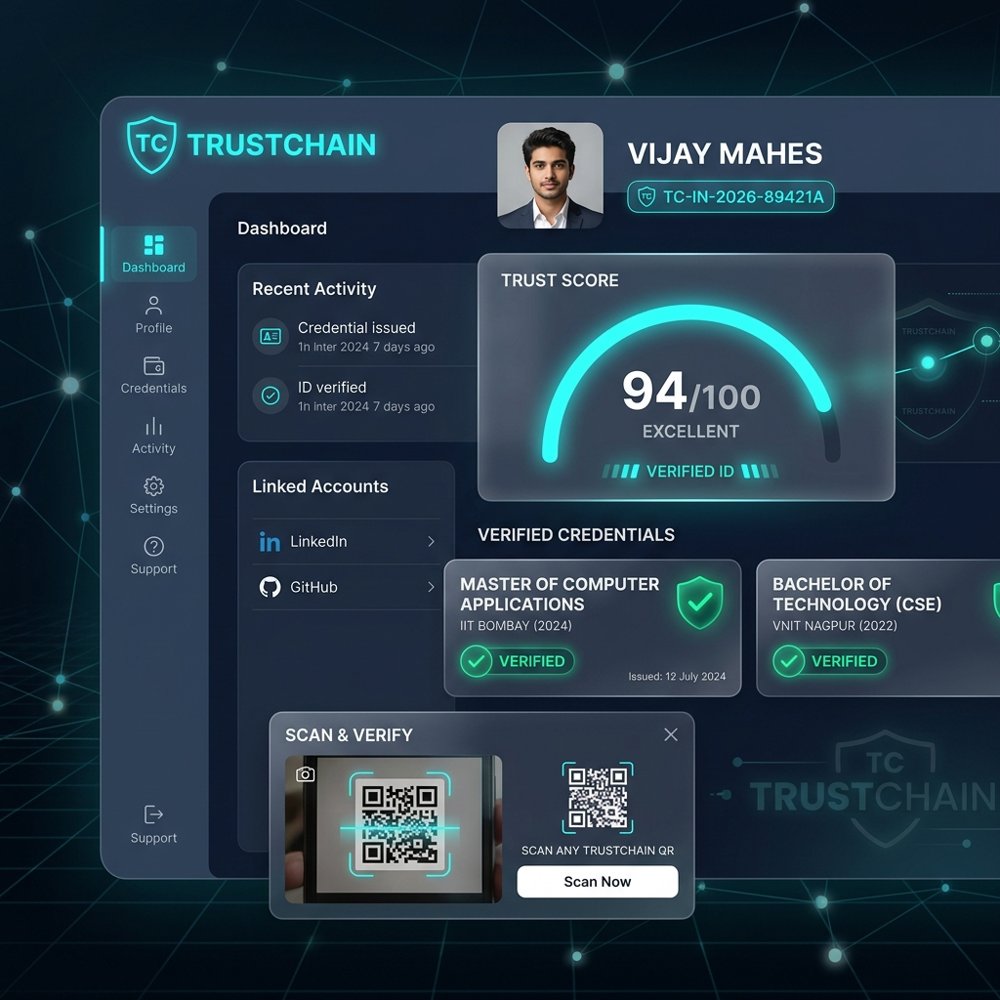
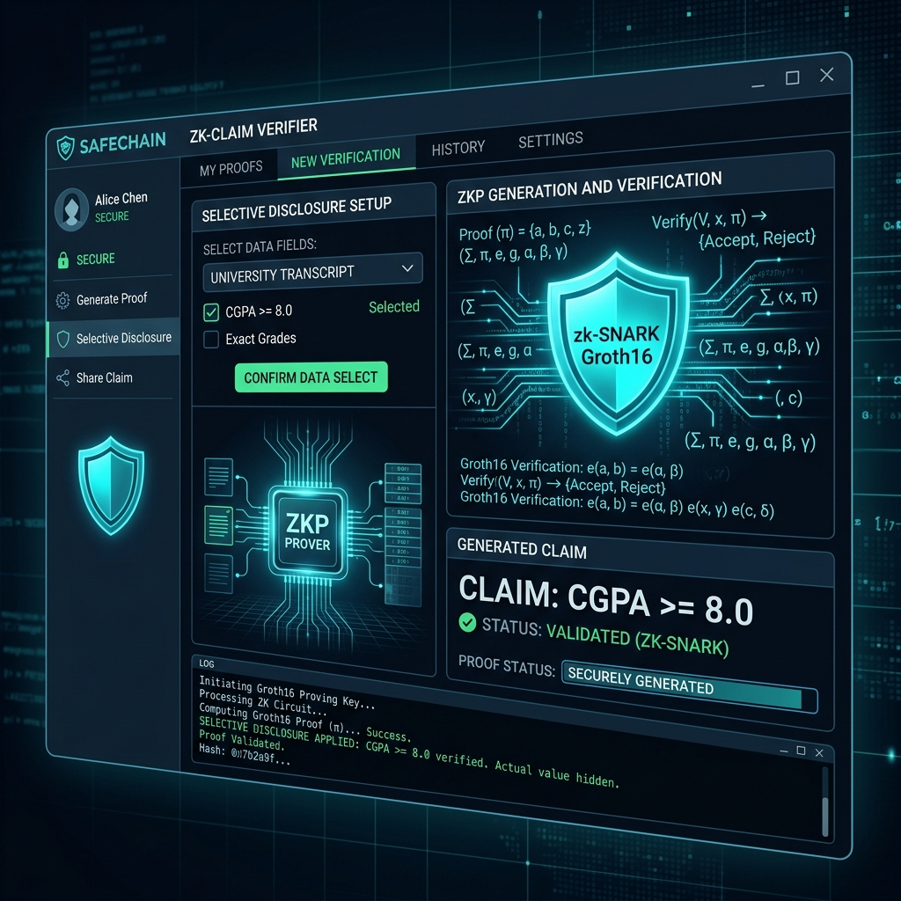
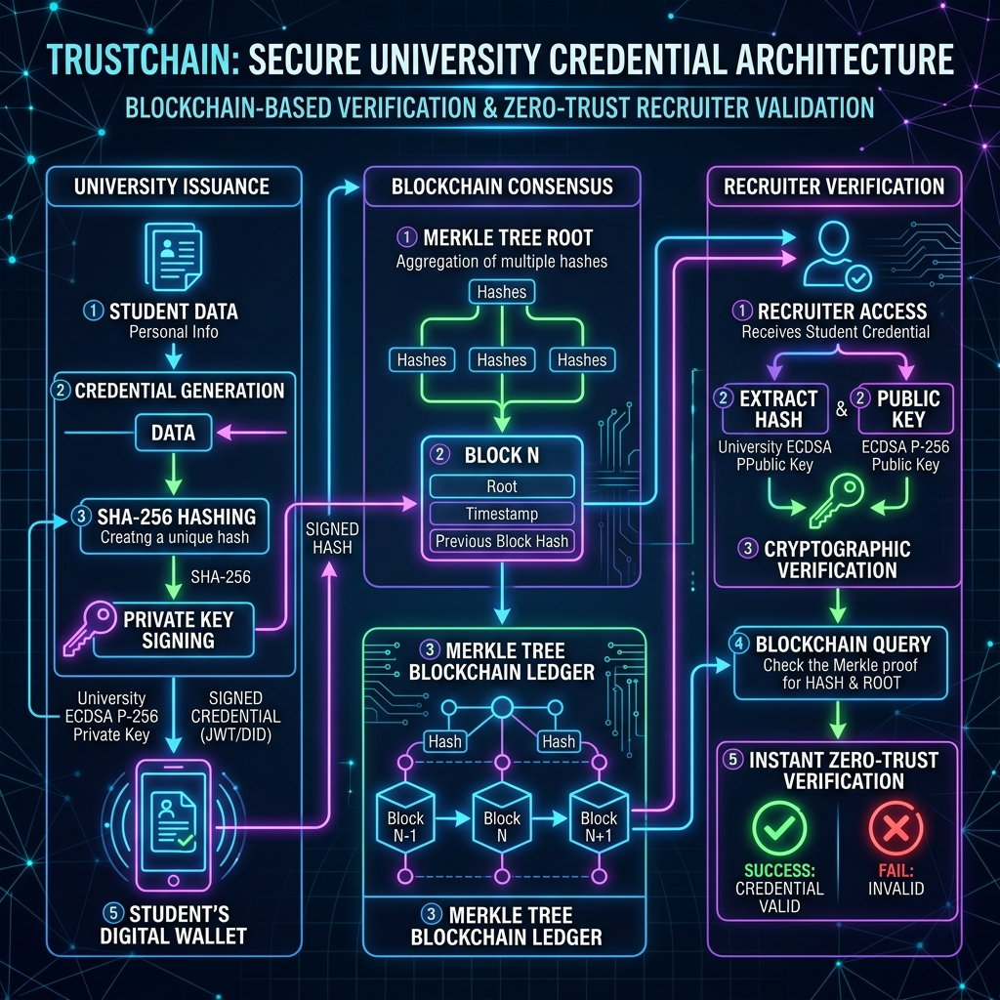
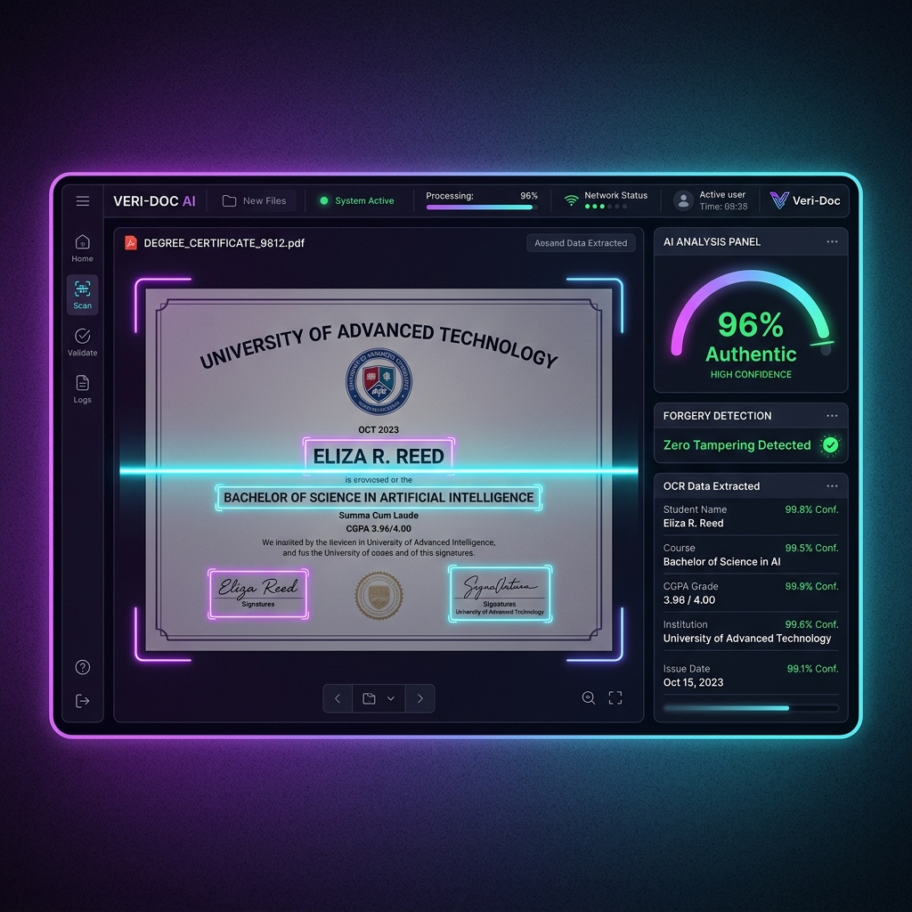

# TrustChain — Universal Verification Platform 🛡️

> **"Verify once, use everywhere."**  
> A portable digital achievement identity and cryptographic credential verification network replacing repeated certificate uploads.

[](https://opensource.org/licenses/MIT)
[](https://github.com/vijaymahes9080/TrustChain)
[](https://github.com/vijaymahes9080/TrustChain)
[](https://vijaymahes9080.github.io/TrustChain/)
[](https://github.com/vijaymahes9080)
[](https://reactjs.org/)
[](https://vitejs.dev/)

🌐 **Live GitHub Pages URL**: [https://vijaymahes9080.github.io/TrustChain/](https://vijaymahes9080.github.io/TrustChain/)

---

## 📸 Interface & Dashboard Showcase



---

## 📖 Overview

**TrustChain** replaces repeated certificate uploads with a **single, trusted digital achievement identity**. Designed as an MCA final-year showcase project and startup-grade architecture, TrustChain allows students and professionals to connect verified education degrees, certificates, GitHub project evidence, and work experience to a single identity (`TC-IN-2026-XXXXXXXX`). 

When applying for jobs, university programs, scholarships, or government schemes, candidates share a **Universal Verification Link or QR Code** for instant cryptographic proof.

```text
                        TRUSTCHAIN NETWORK
                                │
        ┌──────────────┬────────┴───────┬──────────────┐
        ▼              ▼                ▼              ▼
 ┌──────────────┐ ┌────────────┐ ┌────────────┐ ┌─────────────┐
 │ Student App  │ │ University │ │  Company   │ │ Government  │
 │  & Wallet    │ │   Portal   │ │ Background │ │ Qualification│
 └──────────────┘ └────────────┘ └────────────┘ └─────────────┘
```

---

## ✨ Key Features & Innovation Highlights

### 1. 👤 Student Achievement Wallet & Digital Identity
- **Unique Digital Identity**: `TC-IN-2026-89421A` badge with QR code generator.
- **Transparent Trust Score Engine**: Dynamic score (0–100) detailing exact point factors (+40 Inst, +20 Degree, +15 Certs, +15 GitHub Projects, +8 Skills, +2 Profile).
- **Universal Verification Link**: Shareable route (`trustchain.app/u/TC-IN-2026-89421A`) accessible without login.
- **Selective Disclosure Matrix**: Control granular visibility for GPA, phone, address, and repositories.

### 2. 🔐 Zero-Knowledge Proof (ZKP) Studio

- Powered by **zk-SNARK (Groth16 over BN128 curve)**.
- Prove statements (e.g., *"I hold an authentic MCA degree with CGPA >= 8.0"*) without exposing actual transcript marks or personal data.

### 3. 🏛️ Cryptographic Signatures & Block Ledger Architecture

- Cryptographic signing using **ECDSA P-256 keys** and **SHA-256** payload hashing.
- Immutable audit ledger anchored by Merkle trees and validator signatures.

### 4. 🤖 AI Document OCR & Forgery Detection

- Auto-parses legacy certificate PDFs and runs Error Level Analysis (ELA) for document forgery detection.
- Extracted metadata fields automatically populated into institutional issue forms.

### 5. 💼 Company & Recruiter Background Verifier
- 5-Point Cryptographic Check: Exists, Authentic Issuer, Valid Signature, Active Revocation Status, Data Integrity.
- GitHub Code Commit Evidence Inspector backing resume claims.

### 6. 🌐 W3C Verifiable Credentials & DID Export
- Full compatibility with **W3C JSON-LD Verifiable Credentials** standard and Decentralized Identifiers (`did:trustchain:TC-IN-2026-89421A`).

---

## 🛠️ Technology Architecture & Stack

| Layer | Technology |
| --- | --- |
| **Frontend Framework** | React 18 + TypeScript + Vite |
| **Styling & UI** | Tailwind CSS + Lucide Icons |
| **Cryptographic Engine** | Web Crypto API (SHA-256 & ECDSA P-256) |
| **Zero-Knowledge Proofs** | zk-SNARK Groth16 Simulator |
| **AI Document Analyzer** | OCR Field Extractor & ELA Anomaly Detector |
| **Standards** | W3C Verifiable Credentials JSON-LD & DID |

---

## ⚡ Quick Start & Development

```bash
# Clone the repository
git clone https://github.com/vijaymahes9080/TrustChain.git
cd TrustChain

# Install dependencies
npm install

# Launch development server
npm run dev

# Build for production
npm run build
```

---

## 🌐 Public Verification API Reference

```bash
curl -X GET "https://api.trustchain.gov.in/v1/verify/TC-IN-2026-89421A" \
  -H "Authorization: Bearer tc_live_key" \
  -H "Accept: application/json"
```

**Response:**
```json
{
  "status": 200,
  "verification": {
    "tc_id": "TC-IN-2026-89421A",
    "student_name": "Vijay Mahes",
    "university": "Gandhigram Rural Institute",
    "trust_score": 94,
    "qualification": "Master of Computer Applications (MCA)",
    "degree_credential": {
      "status": "ACTIVE",
      "digital_signature": "SIG_P256_v1:8f9a12b4e5c6d7a8b9c0d1e2f3a4b5c6.1786523910.INST_GRI_001",
      "grade": "9.4 CGPA (First Class Distinction)"
    }
  }
}
```

---

## 📄 License

This project is licensed under the MIT License - see the [LICENSE](LICENSE) file for details.

---

## 👨‍💻 Developer & Author

- **Developer**: Vijay Mahes
- **Email**: Vijaypradhap2004@gmail.com
- **Repository**: [https://github.com/vijaymahes9080/TrustChain](https://github.com/vijaymahes9080/TrustChain)
- **Institution**: Gandhigram Rural Institute (Deemed University)
